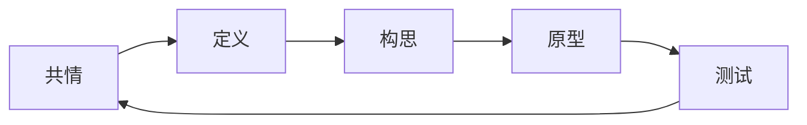

设计思维是一个非线性、迭代的创意问题解决流程，将人置于核心位置。Maya 的工作流引导你完成全部五个阶段。

## 五个阶段概览

设计思维依次经过共情、定义、构思、原型和测试：

这个过程是迭代的——测试往往会揭示新的共情需求，重启循环。

## 阶段 1：共情

**目标：** 理解你为之设计的人。

共情阶段建立对用户需求、行为、态度和上下文的深入理解。没有这个基础，解决方案会解决错误的问题。

| 活动 | 目的 |
| ---- | ---- |
| **用户访谈** | 用用户自己的话直接倾听 |
| **观察** | 观察人们实际做什么，而不是他们说什么 |
| **共情地图** | 将观察整理为用户想什么、感受什么、看到什么、做什么 |
| **旅程图** | 绘制用户在时间维度上的完整体验 |

:::tip[Maya 的强调]
Maya 始终将注意力拉回到"他们而不是我们"——和用户一起设计，而不是为用户设计。通过真实人类互动进行验证胜过一切假设。
:::

## 阶段 2：定义

**目标：** 框架化一个以用户为中心的问题陈述。

定义阶段将共情研究综合为清晰、可执行的问题陈述。好的定义能引导构思而不限制它。

| 产出 | 说明 |
| ---- | ---- |
| **观点陈述（POV）** | 以用户为中心的问题陈述 |
| **How Might We（HMW）问题** | 将问题重新定义为机会 |
| **问题陈述** | 对需要解决什么的清晰表达 |

**POV 示例：**
"忙碌的家长需要一种方式来感觉与孩子的教育保持连接，因为当前的沟通方式分散且耗时。"

## 阶段 3：构思

**目标：** 生成广泛的解决方案。

构思阶段创造选项的数量和多样性。此处的发散思维防止过早收敛到第一个显而易见的方案。

| 方法 | 工作方式 |
| ---- | -------- |
| **头脑风暴** | 快速生成大量想法 |
| **草图** | 视觉思维探索文字之外的可能 |
| **故事板** | 叙事式探索用户体验 |
| **最差想法** | 翻转以逆转约束 |

Maya 强调：先发散再收敛。在评估任何想法之前先生成 50+ 个。

## 阶段 4：原型

**目标：** 让想法变得有形且可测试。

原型是传达想法本质的粗略表现。它们不追求精致——它们追求学习。

| 保真度 | 适用场景 |
| ------ | -------- |
| **纸质草图** | 早期探索、快速迭代 |
| **线框图** | 结构和布局、低细节 |
| **点击流** | 无视觉的交互流程 |
| **绿野仙踪法** | 手动模拟数字功能 |

:::caution[做原型是为了学习]
不要为了打动人而做——要为了学习而做。今天测试的纸质原型胜过做得太晚的完美原型。
:::

## 阶段 5：测试

**目标：** 用真实用户验证解决方案。

测试揭示原型是否解决了真正的问题。负面结果是宝贵的学习——它们避免了构建错误的东西。

| 活动 | 目的 |
| ---- | ---- |
| **可用性测试** | 观察用户与原型的交互 |
| **反馈捕获** | 听取什么有效、什么无效 |
| **假设验证** | 确认或否定设计假说 |
| **迭代规划** | 确定下一步要改变什么 |

## 非线性进展

设计思维看起来是线性的，但很少直线前进：

| 常见模式 | 发生什么 |
| -------- | -------- |
| **测试揭示共情差距** | 回到阶段 1 进行更深入的理解 |
| **构思产生弱概念** | 回到阶段 2 进行更好的框架化 |
| **原型发现新洞察** | 用新视角回到阶段 1 或 2 |

Maya 引导这个非线性旅程，认识到每个阶段都影响所有其他阶段。

## 设计思维 vs. 其他方法

| 方面 | 设计思维 | 传统产品开发 |
| ---- | -------- | ------------ |
| **起点** | 用户需求和上下文 | 业务需求或技术 |
| **过程** | 迭代、非线性 | 线性、门控式 |
| **风险** | 快速失败、早期学习 | 晚期失败、代价高昂 |
| **产出** | 用户验证的解决方案 | 功能完整的产品 |

## 设计思维何时效果最好

| 场景 | 设计思维为什么有帮助 |
| ---- | -------------------- |
| **新产品开发** | 确保产品-市场匹配 |
| **复杂用户体验** | 绘制完整旅程，不仅是触点 |
| **跨职能对齐** | 共享的共情建立团队共识 |
| **创新机会** | 发现数据中不明显的未满足需求 |

## 下一步

- **[应用设计思维](/zh-cn/how-to/design-thinking/)** — 和 Maya 一起运行设计思维会议
- **[了解头脑风暴技术](/zh-cn/explanation/brainstorming-techniques/)** — 用结构化方法支持构思
